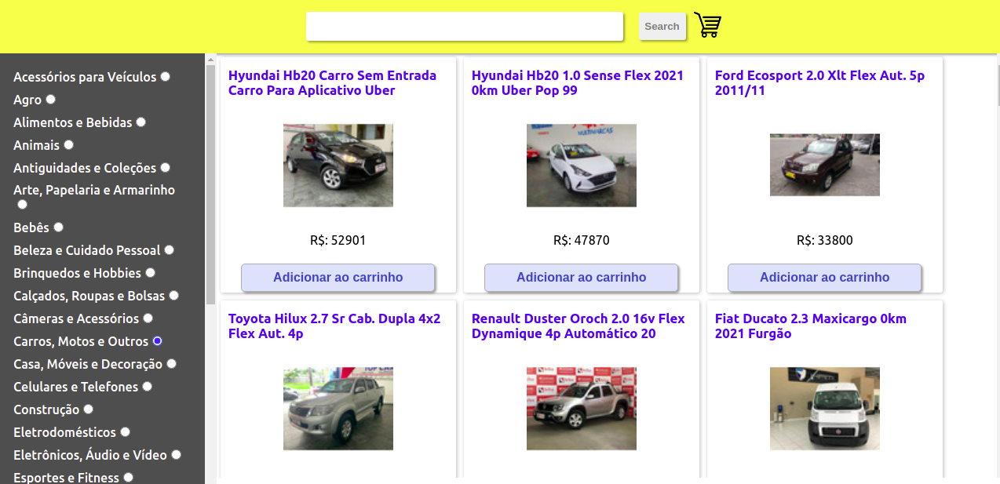

# Welcome to the Front-End Online Store project repository!

## https://online-store-pi.vercel.app/

---  
#### Tech
- ReacJs
- JavaScript
- HTML5
- CSS

In this project you will find a simplified version, without persistence in the database, of an ** online store **. From these demands, we will have an application where users will be able to:
   - Search products by terms and categories from the _API of Mercado Livre_;
   - Interact with the products sought in order to add and remove them from a shopping cart in different quantities;
   - View details and previous evaluations of a product, as well as create new evaluations;
   - And finally, finalize the (simulated) purchase of the selected items.

---------------------------------------------------------------------------------
Esse projeto é uma versão simplificada, sem persistẽncia em banco, de uma loja online. O usuário poderá:  
- Procurar por produtos por termos e categorias vindos da API Mercado Livre;
- Interagir com os produtos, adicionando ao carrinho e mudando suas quantidades;
- Ver os detalhes dos produtos, e criar suas próprias avaliações;
- Ao final, simular o fechamento de um pedido.

